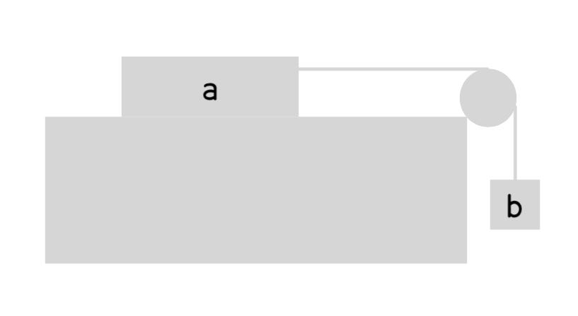

# Theoretical Information

## Basis Theory

The Newton's second law of motion is been used. The law:

> When a body is acted upon by a net force, the body's acceleration
> multiplied by its mass is equal to the net force.

can be represented in equation as: $$F = ma.$$

In the experiment I designed, the force is kept unchanged to make life
easier, and thus we can deduct: $$a = \frac{F}{m}.$$ This leads to our
consequence that the acceleration and the mass is inversely
proportional.

## Theoretical Deduction

The equipments are placed as the figure below:

{width=".78\\hsize"}

Since the two parts of the equipment is connected by a string and their
acceleration is the same, we can see them as one object, and there is
two forces acting on it:

1.  The weight of part b of the object $W_b$;

2.  The friction exerted on part a of the object $f_d$.

Therefore, we can take these variables and apply them using Newton's
second law: $$a = \frac{F_n}{m}.$$

To simplify, we also assume that the surface is perfectly smooth and has
no friction force $f_d = 0 \text{N}$. So the net force of this object
is: $$F_n = W + f_d = W.$$

So now the relationship we found between the acceleration and the mass
is: $$a = \frac{W}{m} = \frac{m_b \cdot g}{m_a + m_b}.$$ The
acceleration is equivalent to the quotient of the product of the object
b's mass and gravitational acceleration and the total mass of the
object.

# Variables

## Independent Variables

We say a variable is independent means that the variable that changes
and affects the value of the variable which we are going to evaluate.
Here, it is the mass of the entire object, or more specifically, the
mass of the object a which is represented as $m_a$. In this experiment,
this variable will be changed by adding heavy objects which mass is a
constant on the object a. Its mass is measured with a electronic scale.

## Dependent Variables

The dependent variable changes according to the independent variable,
and in our case is the acceleration $a$. We use a sensor to plot its
speed-time graph, and calculate the acceleration by applying
$a = \frac{v}{t}$ to it.

## Controlled Variables

The mass of the object b is controlled to ensure the initial force is
the same.
